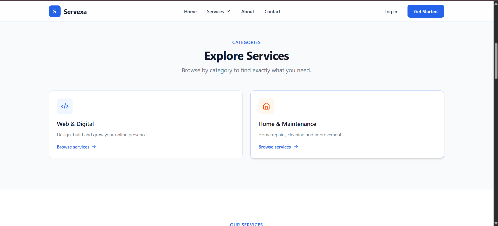
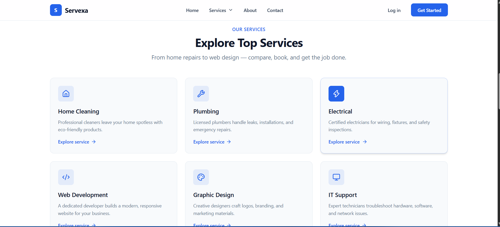
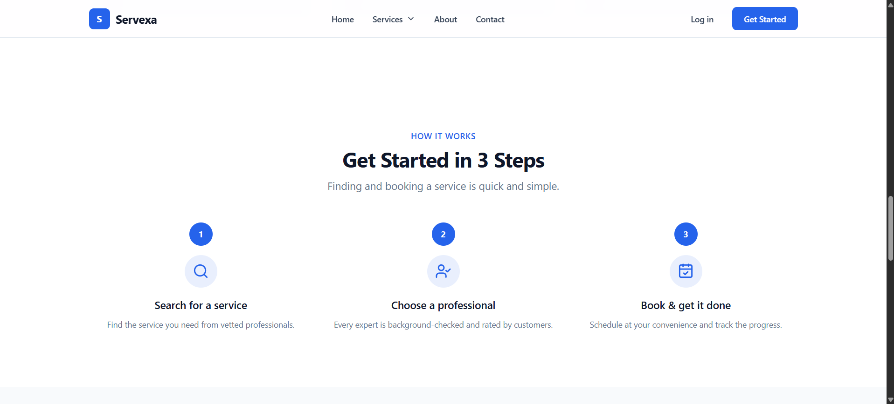
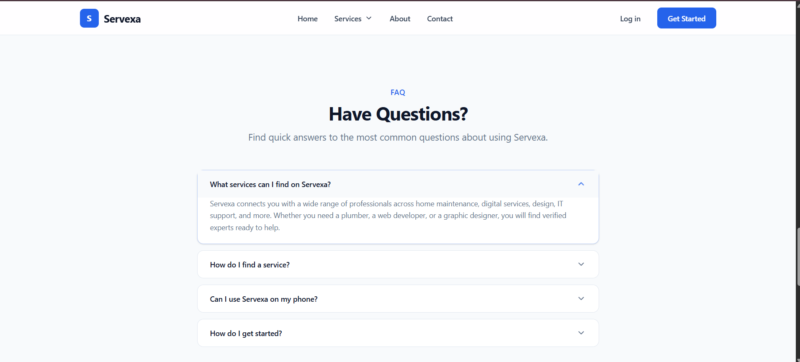
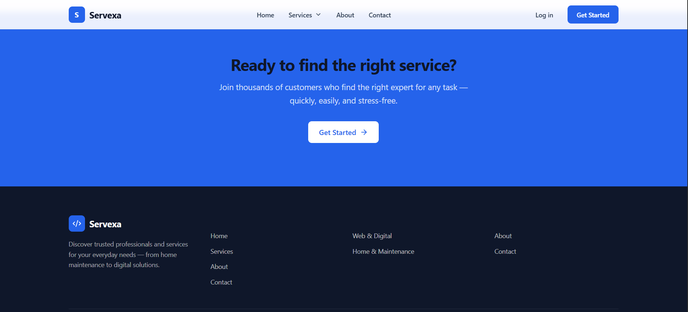

# Servexa: Frontend Developer Assessment

A responsive service platform homepage built as part of the Frontend Developer practical assessment for Web InfoTech Nepal.

## Live Demo

https://web-infotech-frontend-assessment.vercel.app/

## Screenshots








## Tech Stack

- React 19
- TypeScript
- Vite
- Tailwind CSS v4
- Lucide React

## Features

- Responsive header and navigation
- Services mega menu
- Mobile navigation
- Hero section with service search
- Search autocomplete
- Service categories
- Featured service cards
- How It Works section
- FAQ accordion
- Call-to-action section
- Responsive footer
- Desktop, tablet, and mobile layouts

## Project Structure

```
src/
├── components/
│   ├── sections/
│   │   ├── Header
│   │   ├── Hero
│   │   ├── Categories
│   │   ├── FeaturedServices
│   │   ├── HowItWorks
│   │   ├── Faq
│   │   ├── Cta
│   │   └── Footer
│   │
│   └── ui/
│       ├── Accordion
│       ├── Button
│       ├── Container
│       ├── SearchBar
│       └── SectionHeading
│
├── data/
└── App.tsx
```

## Technical Explanation

The project uses React 19 with TypeScript and Vite for fast builds, Tailwind CSS v4 for responsive styling, and Lucide React for icons.

All service data is static/local with no backend required.

Interactive features include search with autocomplete, a services mega menu, mobile navigation, and a FAQ accordion.

Components are split into reusable UI primitives (`src/components/ui/`) and page-level sections (`src/components/sections/`) to keep the codebase clean and maintainable.

## Running Locally

```bash
npm install
npm run dev
```

## Production Build

```bash
npm run build
```

## Assessment

Built for the Web InfoTech Nepal Frontend Developer practical assessment.
